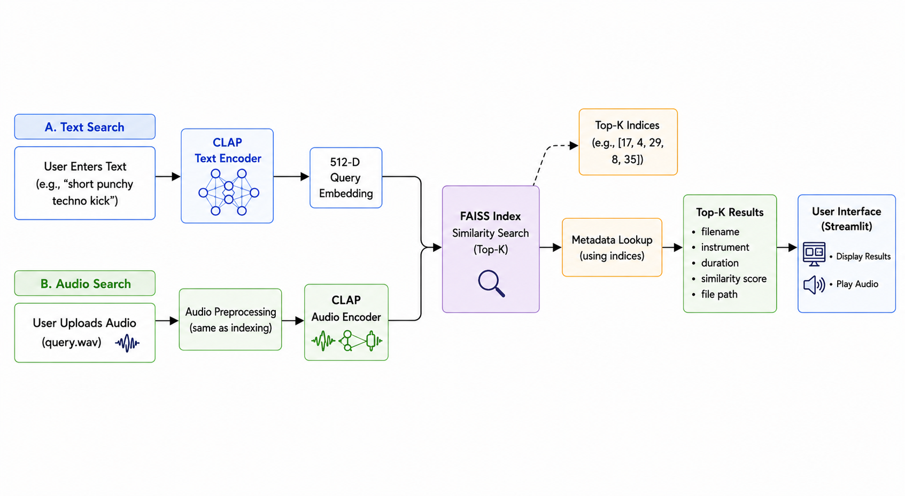

# ◈ Semantic Audio Search

> Retrieve music samples by meaning

An AI-powered retrieval engine built on **CLAP embeddings** and **FAISS**. Describe a sound in plain language, or upload a reference clip, and the engine finds what matches, acoustically and semantically.

No filenames. No metadata. Just the audio itself.

---

## How It Works

<div align="center">



</div>

Text and audio embeddings live in the **same 512-dimensional space**, and one index handles both query modes.

---

## Indexing Pipeline

Each sample is preprocessed before embedding:

<div align="center">

```
kick.wav
  │
  ├─ Resample → 48 kHz
  ├─ Mono conversion
  ├─ Trim silence
  └─ Peak normalize
        ↓
  CLAP Audio Encoder
        ↓
  512-D Vector  →  FAISS Index
                →  metadata.pkl  (filename, instrument, duration, path)
```

</div>

---

## Features

- Semantic **text-to-audio** search via natural language
- Semantic **audio-to-audio** similarity search
- LAION CLAP multimodal embeddings
- Fast nearest-neighbor retrieval with FAISS
- Automatic audio preprocessing (resample, trim, normalize)
- Streamlit UI for interactive exploration
- Embedding model cached for low-latency inference

---

<h2 align="center">Tech Stack</h2>

<div align="center">

<table>
  <tr>
    <th>Layer</th>
    <th>Technology</th>
  </tr>
  <tr>
    <td>Language</td>
    <td>Python</td>
  </tr>
  <tr>
    <td>UI</td>
    <td>Streamlit</td>
  </tr>
  <tr>
    <td>Audio Processing</td>
    <td>Librosa</td>
  </tr>
  <tr>
    <td>Deep Learning</td>
    <td>PyTorch</td>
  </tr>
  <tr>
    <td>Embedding Model</td>
    <td>LAION CLAP</td>
  </tr>
  <tr>
    <td>Vector Search</td>
    <td>FAISS</td>
  </tr>
  <tr>
    <td>Transformers</td>
    <td>HuggingFace Transformers</td>
  </tr>
</table>

</div>

## Project Structure

```
.
├── backend/
│   ├── app.py          ← Streamlit interface
│   ├── embed.py        ← CLAP embedding logic
│   ├── preprocess.py   ← Audio normalization pipeline
│   ├── search.py       ← FAISS query handling
│   ├── build_index.py  ← Index construction
│   └── index/
│       ├── audio.index
│       └── metadata.pkl
│
├── dataset/
│   ├── kick/
│   ├── snare/
│   ├── clap/
│   └── hat/
│
└── README.md
```

---

## Build & Run

```bash
# Build the FAISS index
python build_index.py
# → generates index/audio.index and index/metadata.pkl

# Launch the app
streamlit run app.py
```

---

## Dataset

The prototype indexes ~40 drum samples across four classes: **kick, snare, clap, hi-hat**.

The retrieval pipeline is dataset-agnostic, and scaling to thousands of samples requires only rebuilding the FAISS index.

---

## What This Explores

CLAP (Contrastive Language-Audio Pretraining) projects both text and audio into a shared embedding space. This project applies that to sample retrieval: instead of tagging files manually, the system understands acoustic and semantic similarity directly from the signal.

The result is a search experience closer to how producers actually think - *"something dark and metallic"* - rather than how file systems are organized.
